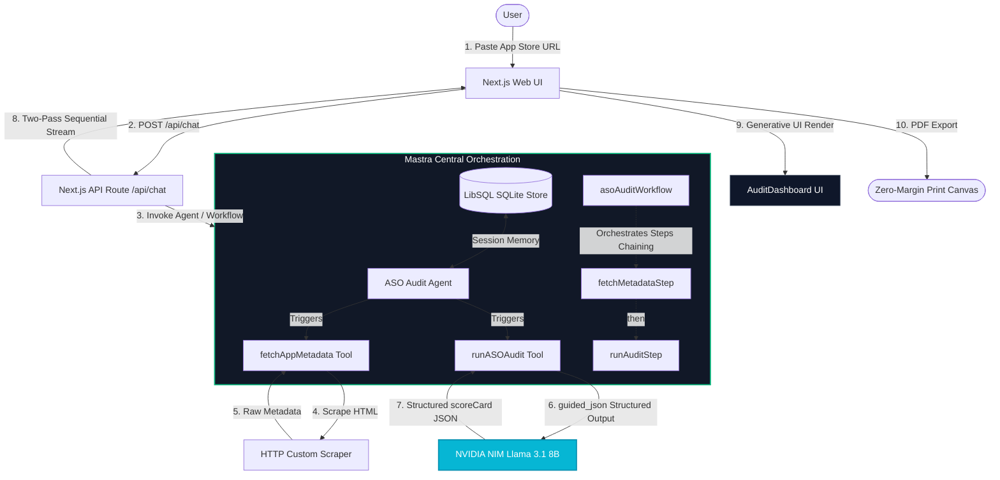

# StoreLens AI — Enterprise ASO Auditing Console

StoreLens AI is a high-performance App Store Optimization (ASO) Auditing Platform. Built using **Next.js App Router**, **TypeScript**, and **Mastra**, it features a multi-turn conversational loop, surface-level App Store metadata verification, a deep 10-dimension ASO audit reasoning engine, and a premium print-ready digital dashboard.
<video src="https://github.com/user-attachments/assets/cd1a606b-9410-4bb8-978a-96361a6d07fa" width="100%" controls autoplay loop muted></video>

---

## 🗺️ System Architecture

The diagram below details the end-to-end dataflow, showing how the client runtime, Next.js API routes, Mastra core orchestration, and NVIDIA NIM endpoints integrate:



---

## ✨ Core Features

* **Mastra Central Orchestration:** Utilizes Mastra Agents, custom Tools (`fetchAppMetadata`, `runASOAudit`), and multi-step Workflows (`asoAuditWorkflow`) to manage sequential discovery and type-safe auditing.
* **NVIDIA NIM LLM Engine:** Employs Llama 3.1 8B Instruct with structured outputs (accelerated by `guided_json`) to perform a deep 10-dimension ASO analysis in under 15 seconds.
* **Robust Two-Pass Streaming:** Bypasses LLM output limitations using a customized backend pipeline that streams both structured tools and textual summaries in a single connection.
* **Premium PDF Report Exports:** Features custom-tailored dark-theme layouts that print beautifully with clean pagination, no margin bleed, and professional branding elements.


---

## ⚡ Quick Start & Setup

### 1. Prerequisite Dependencies
Ensure you have **Node.js 18+** installed on your system.
```bash
npm install
```

### 2. Configure Environment Keys
Duplicate the `.env.example` file and rename it to `.env`. Add your NVIDIA API Key:
```env
NVIDIA_API_KEY="nvapi-your-key-here"
```

### 3. Start the Local Server
Launch the development server. The project compiles with strict type checks.
```bash
npm run dev
```
Open [http://localhost:3000](http://localhost:3000) in your browser.

### 4. Usage
Paste an Apple App Store URL (e.g. `https://apps.apple.com/us/app/spotify-music-and-podcasts/id324684580`) in the input box, verify the app Discovery card, and click **Run Full Audit**. Export a gorgeous dark-mode report by clicking **Export to PDF**.
